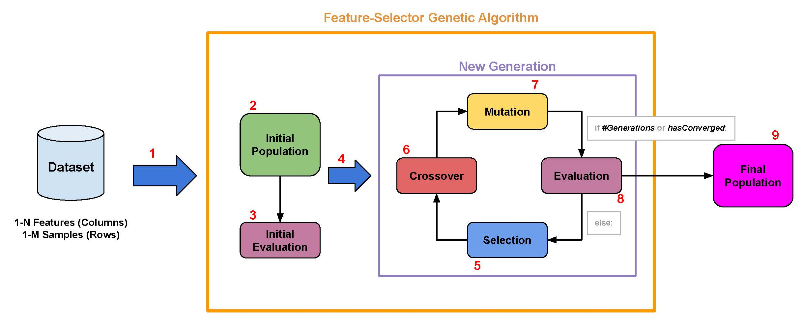

<a href="http://atvs.ii.uam.es/atvs/">
    
</a>

# Feature-Selector Genetic Algorithm

This repository contains the Python implementation of a genetic algorithm developed by the BiDA Lab team. This algorithm was created to choose the best subset of features from a original dataset.

## Table of content

- [Installation](#install)
- [Requirements](#requirements)
- [How Does It Works?](#howdoesitworks)
  - [Population](#population)
  - [Selection](#selection)
  - [Crossover](#crossover)
  - [Mutation](#mutation)
  - [Evaluation](#evaluation)
- [Options](#options)
- [Example of use](#example)
- [References](#references)

## <a name="install">Installation</a>

Simply clone this repository and run `pip setup.py install`.

To uninstall run `pip uninstall genetic_selector`.

## <a name="requirements">Requirements</a>

- Python >= 3.6
- numpy >= 1.18
- pandas >= 1.0.1

### <a name="howdoesitworks">How Does It Works?</a>

The genetic algorithm is a metaheuristic algorithm based on Charles Darwin's theory of evolution. In particular, it is mainly inspired on the natural selection process of evolution, where over generations and through the use of operators such as mutation, crossover and selection, a positive evolution towards better solutions occurs. Originally, the genetic algorithm was created as a search algorithm, but in this case, it has been adapted to find the subset of features that works best for a given problem.

</br>



</br>

From the original dataset, with *N* features and *M* samples, an initial population of size `n_population` chromosomes is created. Each chromosome is a binary vector of size N (number of features), where 1 represents that the feature at that position is selected and 0 that it is not. Each chromosome represents a solution (a subset of selected features). Therefore, the initial population has `n_population` initial solutions.

### <a name="population">Population</a>

Each of the chromosomes belonging to the population is formed by a binary Numpy array, where each position refers to each of the features of the data set. The value one will indicate that the characteristic will be used and zero that it will not.

### <a name="selection">Selection</a>

To carry out the selection process, the entire population is evaluated using the model's average, the best chromosome is selected and the remaining chromosomes are selected per *tournament_k* size tournament.

### <a name="crossover">Crossover</a>

To make the crossing, mathematical hope is used. That is, if the probability of crossing is 0.5 and we have a population size of 300 (150 pairs), the mathematical hope tells us that approximately 75 crosses will be made. The crossing is done by cutting through a random position of all the genes.

```bash
n_crosses = crossover_rate * (population_size / 2)
```

### <a name="mutation">Mutation</a>

For the mutation process, we again use mathematical hope. That is, if we have a mutation probability at the gene level of 0.2 and a total number of genes of 6000, then the number of mutations that will be made on average will be 1200. Mutations will be made by generating two random numbers per mutation, one to choose the chromosome and one to choose the gene to change.

### <a name="evaluation">Evaluation</a>

To "see how good" each of the population's chromosomes are, the average obtained from the use of a Scikit-learn classification model will be used. In addition, this model will be trained using cross-validation for validation.

```bash
n_mutations = mutation_rate * population_size * genes_per_chromosome
```

## <a name="options">Options</a>

## <a name="example">Example of Use</a>

```python
import pandas as pd
from genetic_selector import GeneticSelector
from sklearn import datasets
from sklearn.ensemble import RandomForestClassifier
from sklearn.model_selection import train_test_split

if __name__ == '__main__':
    # You should not set the number of cores (n_jobs) in the Scikit-learn
    # model to avoid UserWarning. The genetic selector is already parallelizable.
    rf_clf = RandomForestClassifier(n_estimators=300)

    # Load example dataset from Scikit-learn
    dataset = datasets.load_wine()
    X = pd.DataFrame(data=dataset['data'])
    y = pd.Series(data=dataset['target'])

    # Split into train and test
    train_X, test_X, train_y, test_y = train_test_split(X, y, test_size=0.25)

    # Create GeneticSelector instance
    genetic_selector = GeneticSelector(rf_clf, cv=5, n_gen=50, n_population=150,
                                        crossover_rate=0.8, mutation_rate=0.15,
                                        tournament_k=2, return_train_score=True, initial_best_chromosome=None,
                                        n_jobs=-1, random_state=42, verbose=0)
    # Fit features
    genetic_selector.fit(train_X, train_y)

    # Get result
    support = genetic_selector._support()
    best_chromosome = support[0][0]
    score = support[0][1]
    best_epoch = support[0][2]
    print(f'Best chromosome: {best_chromosome}')
    print(f'Average score: {score}')
    print(f'Best epoch: {best_epoch}')

    test_scores = support[1]
    train_scores = support[2]
    chromosomes_history = support[3]
    print(f'Test scores: {test_scores}')
    print(f'Train scores: {train_scores}')
    print(f'Chromosomes history: {chromosomes_history}')
```

## <a name="references">References</a>

- R. Tolosana, J.C. Ruiz-Garcia, R. Vera-Rodriguez, J. Herreros-Rodriguez, S. Romero-Tapiador, A. Morales and J. Fierrez, **"Child-Computer Interaction: Recent Works, New Dataset, and Age Detection"**, *IEEE Transactions on Emerging Topics in Computing*, doi: [10.1109/TETC.2022.3150836](https://www.doi.org/10.1109/TETC.2022.3150836), 2022.

- G. Chandrashekar, F. Sahin, A survey on feature selection methods, *Comput. Electr. Eng.* 40 (2014) 16-28, doi: [10.1016/j.compeleceng.2013.11.024](https://doi.org/10.1016/j.compeleceng.2013.11.024).

- W.F. Punch, E.D. Goodman, M. Pei, L. Chia-Shun, P.D. Hovland, R.J. Enbody, Further Research on Feature Selection and Classification Using Genetic Algorithms, in *Proc. 5th Int. Conf. Genet. Algorithms*, 1993.
